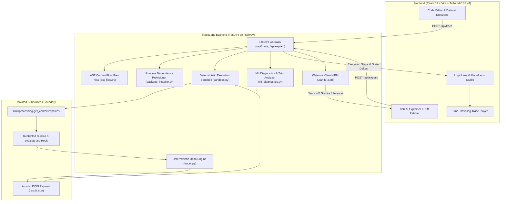

# TraceLens — AI-Powered Code Tracer & DSAI Runtime Auditor

[](https://fastapi.tiangolo.com)
[](https://www.python.org/)
[](https://react.dev/)
[](https://vitejs.dev/)
[](https://tailwindcss.com/)
[](https://www.ibm.com/granite)
[](https://railway.app)
[](https://vercel.com)

**TraceLens** is an advanced, production-grade visual code tracer and runtime DSAI/ML auditor built for the **IBM Bob 2.0 Hackathon (lablab.ai)**. 

Static code analysis can only predict what *might* happen. TraceLens tells developers and data scientists what *actually* happened at runtime — recording every line execution, variable mutation, loop iteration, branch decision, tensor shape transition, and data-leakage flaw in real time, accompanied by contextual, zero-hallucination explanations powered by **IBM Granite 3.8B**.

---

## 🌟 Live Deployments

- **Frontend Application (Vercel):** [https://tracelens-six.vercel.app](https://tracelens-six.vercel.app) *(or `https://tracelens-ivory.vercel.app`)*
- **Backend API (Railway):** [https://tracelens-backend-production-8083.up.railway.app](https://tracelens-backend-production-8083.up.railway.app)
- **API Health Endpoint:** [https://tracelens-backend-production-8083.up.railway.app/health](https://tracelens-backend-production-8083.up.railway.app/health)

---

## 🚀 Key Modules & Capabilities

TraceLens features a dual-engine architecture:

### 1. LogicLens (Core Runtime Tracer)
Designed for algorithms, data structures, and general-purpose Python pipelines:
- **Interactive Time-Traveling Scrubber:** Step forward, backward, play/pause, scrub to specific steps, and adjust playback speed dynamically.
- **State Board & Variable Deltas:** Real-time register inspector showing current variable values, mutation history, scalar deltas, and data types across time.
- **Hierarchical Loop Visualizer:** Unrolls complex nested loops into parent-child iteration trees, tracking iteration counters, inner/outer boundaries, and early-exit `break`/`continue` hooks.
- **Branch Decision Analyzer:** Visualizes boolean condition evaluations on `if`/`elif`/`else` blocks, explicitly highlighting chosen vs. unvisited pathways.
- **Terminal Output Stream:** Monospace real-time stdout capture, synchronized step-by-step with print statement executions.

### 2. ModelLens (Data Science & ML Auditor)
A specialized runtime auditor purpose-built for Data Science & Machine Learning pipelines:
- **Data Leakage Forensics:** Intercepts mathematical moment contamination (e.g., executing `scaler.fit_transform()` across the entire dataset *prior* to `train_test_split()`).
- **Class Imbalance & Scale Auditing:** Detects hazardous label ratios (e.g. 11.5 : 1) and flags unscaled features fed into distance-based or gradient estimators.
- **Synthetic Oversampling Checks:** Identifies improper pre-split SMOTE/imbalanced-learn applications that lead to optimistic evaluation scores and data leakage.
- **Live In-Place Remediation:** Proposes structural, color-coded Git diff patches and offers a one-click **"Apply Fix"** action that replaces contaminated code in real-time, removes alerts, and updates execution metrics.

### 3. Bob AI Explainer (IBM Granite 3.8B)
- **Context-Grounded Explanations:** Explains execution logic strictly using real runtime trace deltas — zero hallucinations.
- **Multi-Line & Code Block Auto-Detection:** Select multiple lines or auto-detect loop/conditional blocks to receive plain-English structural summaries and step-by-step behavioral breakdowns.
- **In-Memory Cache (20-min TTL):** Hash-indexed prompt-response cache for near-instant replays, with a forced "Regenerate" option.

---

## 🏗️ System Architecture



---

## 🔬 Deep Technical Implementation

### 1. Deterministic Execution Tracing (`sys.settrace`)
TraceLens uses a two-level trace architecture to minimize runtime overhead:
- **Global Call Filter:** Evaluated once per frame entry (`event == 'call'`). Evaluates the frame's `co_filename` against the dedicated sandboxed user string `<tracelens_user_code>`. Library code, standard library modules, and third-party dependencies are skipped entirely.
- **Local Line Tracer:** Remains hooked only within user code frames, recording `line`, `call`, `return`, and `exception` events.
- **Delta Engine:** Computes exact variable diffs between consecutive steps. For primitives, it captures value transitions (`x: 0 -> 1`). For collections, it logs additions/deletions. For DataFrames and ndarrays, it tracks dimensions (`shape: (1000, 8)`), column names, memory footprints, and null-value distributions.

### 2. AST Control-Flow Pre-Pass (`ast_flow.py`)
Before code executes, an AST visitor traverses the Python syntax tree:
- Indexes start and end lines for `For`, `While`, `If`, and `Try` blocks.
- Builds an indexed lookup table mapping runtime line numbers to their structural constructs (loop headers, body ranges, branch decisions, and alternate pathways).
- Prevents invalid syntax from ever reaching the execution sandbox, guaranteeing instant error feedback without process spawn cost.

### 3. Process Isolation & Containment (`sandbox.py`)
- **Spawn Context:** The sandbox launches code inside a clean, fresh child process via `multiprocessing.get_context("spawn")`. No memory, file descriptors, or global states are shared between runs.
- **Hard Wall-Clock Timeout:** A dedicated watchdog enforces a strict 30.0-second execution limit. If a user script enters an infinite loop, the child process receives `terminate()`, followed by a non-catchable `kill()` (SIGKILL).
- **Atomic File Transport:** To prevent OS pipe buffer deadlocks when user scripts generate tens of thousands of trace steps or large dataframes, the child process streams checkpoints to disk and atomically publishes `result.json` via `os.replace`.
- **Memory Safety (No Virtual AS Clamping):** Virtual address space clamping (`RLIMIT_AS`) is deliberately omitted in favor of container cgroups, allowing data-science libraries (`numpy`, `pandas`, `scikit-learn`, `scipy`, `imbalanced-learn`) to safely map BLAS/LAPACK contiguous blocks without process termination.

### 4. Automatic Dependency Provisioner (`package_installer.py`)
- Scans user script ASTs for top-level imports.
- Resolves module aliases to canonical PyPI package distributions (`sklearn` -> `scikit-learn`, `imblearn` -> `imbalanced-learn`, `cv2` -> `opencv-python`).
- Automatically provisions missing packages into the runtime environment prior to sandboxed execution, running outside the user's 30s execution timer.

### 5. Ingestion & Dataset Management (`dataset.py`)
- Handles direct CSV/TSV/Parquet file uploads up to 100MB.
- Files are saved to an isolated workspace (`uploaded_datasets/`) and automatically exposed to user scripts via relative path injection (`pd.read_csv("data.csv")`).
- Automatic 20-minute auto-deletion TTL and startup purge guarantee fresh state across deployments.

---

## 📡 API Reference & Contracts

### `POST /api/trace`
Executes user code in the deterministic sandbox and returns the complete trace structure.

**Request Body:**
```json
{
  "code": "x = 10\nfor i in range(3):\n    x += i",
  "filename": "pipeline.py",
  "timeout": 30.0,
  "max_steps": 1000
}
```

**Response Contract:**
```json
{
  "status": "ok",
  "total_steps": 7,
  "steps": [
    {
      "step_index": 0,
      "line_number": 1,
      "code_line": "x = 10",
      "event_type": "line",
      "variables": { "x": 10 },
      "variable_deltas": { "x": { "old": null, "new": 10 } },
      "stdout": ""
    }
  ],
  "flow_index": { ... },
  "safe_insertion_points": [ ... ],
  "ml_audit": {
    "issues": [ ... ],
    "proposed_fix": "..."
  }
}
```

### `POST /api/explain`
Grounded natural language explanation powered by IBM Granite 3.8B.

**Request Body:**
```json
{
  "code": "code snippet",
  "current_line": 14,
  "current_step": 6,
  "step_context": { ... },
  "selected_lines": [12, 13, 14],
  "block_type": "loop",
  "force_regenerate": false
}
```

### `POST /api/upload-dataset`
Multipart form upload for tabular datasets (`.csv`, `.tsv`, `.parquet`).

### `GET /health` & `GET /`
Returns service availability status (`{"status": "ok"}`).

---

## 💻 Local Development Setup

### Prerequisites
- **Python:** 3.11 or 3.12
- **Node.js:** 18+ (with npm)
- **IBM Cloud Account:** (Optional, for WatsonX / Bob AI Granite integration)

### 1. Clone & Environment Configuration
```bash
git clone https://github.com/Omar-astro/Tracelens.git
cd Tracelens

# Copy environment configuration
cp .env.example .env
```

Add your credentials inside `.env`:
```env
IBM_CLOUD_API_KEY=your_ibm_watsonx_api_key_here
BOB_MODEL_ID=ibm/granite-3-8b-instruct
```

### 2. Backend Setup
```bash
# Create virtual environment
python -m venv venv

# Activate virtual environment
# Windows:
.\venv\Scripts\Activate.ps1
# Linux/macOS:
source venv/bin/activate

# Install dependencies
pip install -r backend/requirements.txt

# Start backend server
python backend/run.py
```
Backend will be live at `http://localhost:8000`. API documentation is available at `http://localhost:8000/docs`.

### 3. Frontend Setup
```bash
cd frontend

# Install frontend dependencies
npm install

# Start development server
npm run dev
```
Frontend will be live at `http://localhost:5173`.

### 4. Running Test Suites
```bash
# Run backend test suite (32+ unit and integration tests)
pytest tests/
```

---

## 🚢 Production Deployment

### Backend (Railway)
The backend includes a production-ready [`Dockerfile`](file:///c:/Users/iimon/OneDrive/Documents/uni/year3/IBM%20Lablab%20hackathon/backend/Dockerfile) and [`backend/run.py`](file:///c:/Users/iimon/OneDrive/Documents/uni/year3/IBM%20Lablab%20hackathon/backend/run.py) runner:
1. Connect your repository to **Railway**.
2. Set **Root Directory** to `backend` (or leave as `/`).
3. Ensure **Build Command** is empty (handled by Docker).
4. Add environment variables: `IBM_CLOUD_API_KEY`.
5. Railway assigns a dynamic `$PORT` and routes public traffic with automated SSL.

### Frontend (Vercel)
The frontend is deployed as a Vite Single Page Application:
1. Connect your repository to **Vercel**.
2. Set **Root Directory** to `frontend`.
3. Set **Framework Preset** to `Vite`.
4. Add Environment Variable:
   - **Key:** `VITE_API_BASE_URL`
   - **Value:** `https://your-railway-backend-url.up.railway.app`
   - **Type:** `Config`
5. [`frontend/vercel.json`](file:///c:/Users/iimon/OneDrive/Documents/uni/year3/IBM%20Lablab%20hackathon/frontend/vercel.json) automatically routes all browser navigations through `/index.html`.

---

## 🔒 Security & Safe Computing Policy

- **No Hardcoded Credentials:** All credentials use environment variable injection. `.bobignore` and `.gitignore` prevent credential leaks in commits or AI session logs.
- **Execution Sandbox:** The untrusted execution sandbox blocks direct system modules (`os`, `sys`, `subprocess`, `socket`) and deletes file-opening builtins (`open`).
- **Resource Constraints:** Hard wall-clock deadlines (30s) and step caps (default 1000 steps) guarantee that malformed or malicious scripts cannot freeze host resources.

---

## 👥 Authors & Team

Developed with pride for the **IBM Bob 2.0 Hackathon (lablab.ai)**.
- **Omar Mahmoud**
- **Ebrahim Rabie**
- **Ahmad Magdy**
- **Mazen Mohammed**

*TraceLens — Bridging the gap between static code and dynamic runtime truth.*
